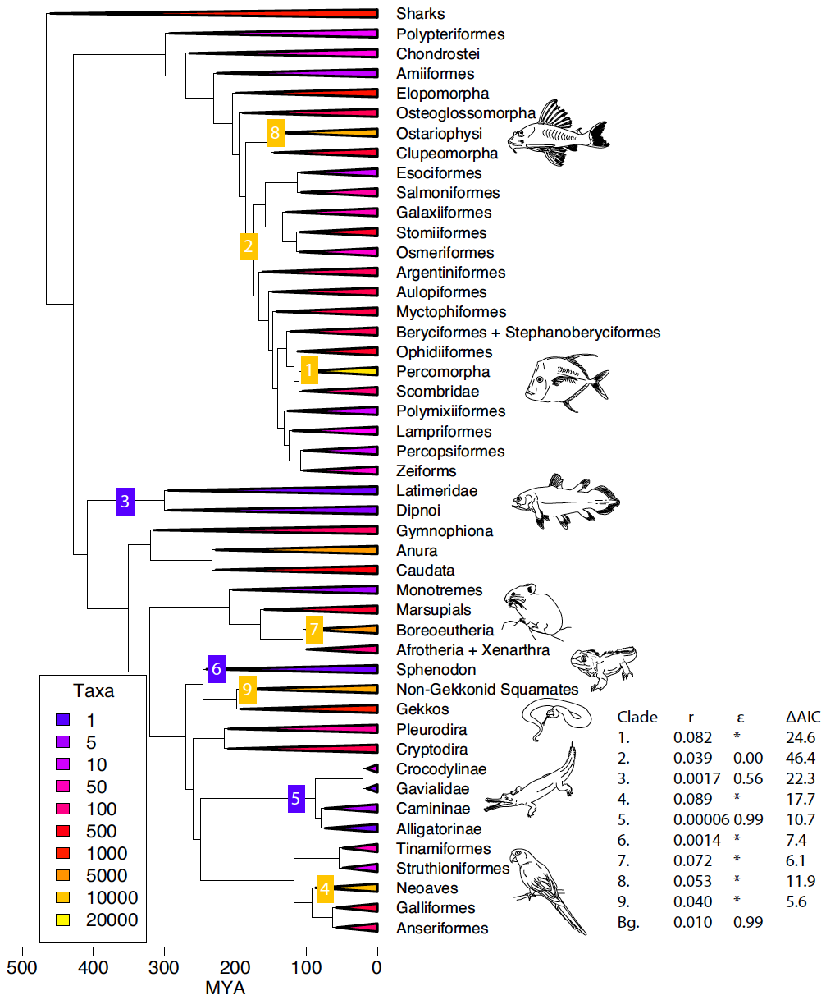
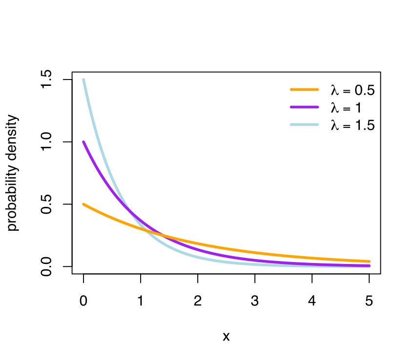

## Before starting: data and R packages

To do the exercises of this tutorial you will need to have the following packages installed.

```{r packages, eval=FALSE}
library(ape)
library(phytools)
library(diversitree)
library(lattice)
library(coda)
```

If some of these are not installed, install them using the `install.packages()` function.

You will also need some data sets. You can download them from the [Github repository for this tutorial](https://github.com/simjoly/CourseComparativeMethods/tree/master/lecture7/data) and place them in your working directory.

# Introduction

When we look at the tree of like or at section of it, one of the first thing we notice if that there is a great imbalance between different lineages. Some lineages are species-rich whereas others are species poor. The figure below shows the evolution of the main lineages of jawed vertebrates and clearly shows that while some lineages possess more than 1000 species, other have less than 10 (figure from Alfaro et al. 2009)!

```{r out.width = "50%", echo=FALSE, message=FALSE, warning=FALSE}
require(knitr)
 
```

This disparity in species number have attracted the interest of biologist for a long time. Evolutionary biologist have wanted to quantify these pattern and a key concept is that of diversification rates.

Diversification consists in the net accumulation of species through time. Conceptually, it is the difference between speciation and extinction. Mathematically, the speciation rate is normally represented by the greek character $\lambda$ and extinction rate by the letter $\mu$. Diversification is thus:

$$Diversification=\lambda-\mu$$.

If $\lambda > \mu$, the diversification rate is positive and the number of species in a group will increase through time. In contrast, if $\lambda < \mu$, the diversification rate is negative and species number are diminishing through time and a group chatacterized by negative diversification will eventually become extinct.


### What do the rates mean ?

Rates can have different meaning in the field of biology. Within evolutionary biology, especially in the field of comparative methods, a rate is an attribute of a species or a lineage.  For instance, the **speciation rate** is the expected number of speciation events expected to occur for a species (of along the branch of a phylogenetic tree) for a certain period of time. As such, a species could be expected to experience 1.3 speciation events per million of years on average.

Because it is an attribute of a lineage, this means that a given group could have much more frequent speciation events. For instance, a group of 10 species with a speciation rate of 1.3 will have an expected 10 * 1.3 = 13 speciation events per million years on average.


## The birth-death model

The birth death model is a continuous-time Markov process that describes how species fluctuate through time. It is a common model for phylogenetic trees and provide a way to simulate them.

Because we cannot have fraction of speciation (or extinction) event for a species for a given amount of time, we need a way to calculate the number of real events. For this, we use the Poisson distribution that describe the probability of observing different number of event given a specific rate and a given period of time.

```{r out.width = "45%", echo=FALSE, message=FALSE, warning=FALSE}
require(knitr)
include_graphics("figures/poisson.png") 
```

This is useful, but even more useful when one wants to simulate a phylogenetic tree or speciation in a population is to estimate the waiting time to a next speciation event. We call this the waiting time. Because of the Poisson distribution, we know that the waiting time to a next event follows an exponential distribution with parameter $\lambda$. Formally, $f(x;\lambda)=\lambda e^{\lambda x}$, where $\lambda$ is the parameter of the distribution.

```{r out.width = "30%", echo=FALSE, message=FALSE, warning=FALSE}
require(knitr)
 
```

To get the distribution of waiting times to the next speciation event, we replace the parameter of the exponential distribuion ($\lambda$) by the speciation rate (also $\lambda$). Similarly, the time to the next extinction event is exponential with parameter $\mu$ and the time to a speciation **or** an extinction event is exponential with parameter $\lambda + \mu$.

The distribution of waiting times depends on the rate and a greater rate results in shorter waiting time on average; the time for a next speciation event to occur will be shorter.

With this info, we could simulate trees!


## Tree simulation

Here is an example of how to simulate a tree in R. The function ```sim.bdtree``` simulates a tree with a birth death model with birth rate (speciation) *b*, death (extinction) rate *d*. The commands `stop="taxa", n=40` indicate to stop the simulation when a number of species is reached, here 40.

```{r "birth_death_tree_sim", echo=TRUE, message=FALSE, warning=FALSE}
library(geiger)
atree <- sim.bdtree(b=0.2,d=0.05,stop="taxa",n=40,seed=46)
plot(atree,show.tip.label = F)
```


## Yule model

The Yule model is another model often used to simulate trees. It is also often called a "pure birth" model. It is a special case of the birth-death model with the extinction rate fixed to 0.

```{r "yule_tree_sim", echo=TRUE, message=FALSE, warning=FALSE}
atree <- sim.bdtree(b=0.2, d=0, stop="taxa", n=40, seed=46)
plot(atree, show.tip.label = F)
```


## Effect on tree shape

Not supringly, the speciation and extinction rates have strong impacts on the shape of the tree. Here are two trees simulated under different speciation and extinction rates.

```{r "effect_parameters", echo=FALSE, message=FALSE, warning=FALSE}
atree1 <- sim.bdtree(b=0.2, d=0.1, stop="taxa", n=40, seed=46)
atree2 <- sim.bdtree(b=0.6, d=0.05, stop="taxa", n=40, seed=46)
op <- par(mfrow=c(1,2))
plot(atree1, show.tip.label = F)
title("lambda=0.2, mu=0.05")
plot(atree2, show.tip.label = F)
title("lambda=0.6, mu=0.05")
par(op)
```


## Estimating divesification rates

One obvious application of these models is to estimate speciation, extinction and diversification rates. But this is a difficult task. Part of the difficulty is that by sampling current species, we do not have the complete information. In particular, we don't know if some species have gone extinct, when they went extinct, and where on the trees those extinct species diverged. Such information is important as is affect the estimation of waiting times and thus it might bias the estimation of speciation and extintion rates. Actually, extinction rates are especially difficult to estimate from phylogenetic tree.

```{r "drop_tips", echo=FALSE, message=FALSE, warning=FALSE}
op <- par(mfrow=c(1,2))
plot(atree1, show.tip.label = F)
title("Real tree")
plot(drop.extinct(atree1), show.tip.label = F)
title("Observed data")
par(op)
```

Another shortcomming occurs when we have not sampled all current (extant) species. For the same reason, this will strongly affect the estimates of speciation and extinction rates.


### An example

Let's look at an example to see how well we could infer rates from a phylogeny. For this, we will first simulate some data. We will simulate a tree of 100 species to see how well we could infer the rates we used for simulating the phylogeny. But first, we will exclude extinct species and we will simulate partial sampling by removing 10% of the species.


```{r "sim_tree", message=FALSE, eval=T}
# Simulate a tree with birth-death process
tree1 <- sim.bdtree(b=0.2,d=0.05,stop="taxa",n=100,seed=46)
# Remove extinct species
tree1 <- drop.extinct(tree1)
# Sample only 90 of the living species. For this we will first sample without replacement 10
#   species from the list of species simulated.
sp.not.sampled <- sample(tree1$tip.label,10,replace=FALSE)
# Now exlude those 10 "unsampled"" species
tree1 <- drop.tip(tree1, sp.not.sampled)
# Look at the phylogenetic tree
plot(tree1, show.tip.label=FALSE)
```


We will now fit a birth-death model and a yule model on the tree. For this we will use the `divesitree` package.

```{r "fit_divers_rate", message=FALSE, eval=T, warning=F}
require(diversitree)

## Fit a Yule model
# Make model
pbModel <- make.yule(tree1)
# Fit the model
pbMLFit <- find.mle(pbModel, 0.1)

## Fit a Birth-death model
# Make model
bdModel <- make.bd(tree1)
# Fit the model
bdMLFit <- find.mle(bdModel, c(0.1, 0.05), method = "optim", lower = 0)
```

Now that we have fit the models, we could compare them.

```{r compare models}
# compare models
anova(bdMLFit, pure.birth = pbMLFit)
```

This compares the full model (more complex) which here is the birth-death model because it has one more parameter. The AIC criteria suggests that the full model is better (AIC is smaller than for the Yule model), but only slightly so as a difference < 2 in AIC is generally considered as not significant. The likelihood ratio test (last column; Pr(>|chi|)) also sugges the difference is not significant at the 5% level. This shows that with a tree of this size, using a small extinction rate (0.05), it is difficult to confirm that the data was simulated under a birth-death model.

Let's now look at the parameter estimates.

```{r param_est_sim}
coef(bdMLFit)
```

You can see that the estimates of the parameters are not very far from the simulated data (speciation = 0.2, extinction = 0.05). So the results are not so bad!

Finally, to estimate the diversification rate, you only have to substract the extinction rate from the speciation rate.

```{r viver_est_sim}
# Diversification rate
speciation <- coef(bdMLFit)[[1]]
extinction <- coef(bdMLFit)[[2]]
(diversification <- speciation - extinction)
```


## Empirical data

For the present tutorial, we will use data from Sánchez-Baracaldo and Thomas (2014) that studied a group of monophyletic ferns from the Jamesonia-Eriosorus Complex from the Andes. They studied mostly the impact of the colonization of the Paramo habitat in diversification rates and on morphology.

Let's read the data and prepare it for the analyses to come.

```{r "paramo data", message=FALSE}
require(ape)
# Read tree
paramotree <- read.nexus("./JamesoniaPartFind_MCC.tre")
# Read data
paramodata <- read.csv("./JamesoniaTraits2014Analysis.csv")
# Remove species for which we don't have complete data
paramodata <- paramodata[!is.na(paramodata$Name_in_tree),]
# Remove species in the tree that are not in the data matrix
species.to.exclude <- paramotree$tip.label[!(paramotree$tip.label %in% 
                                                   paramodata$Name_in_tree)]
paramotree <- drop.tip(paramotree,species.to.exclude)
rm(species.to.exclude)
# Name the rows of the data.frame with the species codes used as tree labels
rownames(paramodata) <- paramodata$Name_in_tree
# Remove unecessary variables
paramodata <- paramodata[,-c(1:3,7:14)]
# Order the data in the same order as the tip.label of the tree. In the
# present example, this was already the case.
paramodata <- paramodata[paramotree$tip.label,]
```

The tree is stored in the variable `paramotree` and the data in the variable `paramodata`.


## Practicals 1

Using the approach used above, estimate the speciation, extinction and diversification rates for the Jamesonia-Eriosorus dataset.

```{r "Practical_1", eval=F, echo=F}
# Fit a Yule model
pbModel <- make.yule(paramotree)
pbMLFit <- find.mle(pbModel, 0.1)

# Fit a Birth-death model
bdModel <- make.bd(paramotree)
bdMLFit <- find.mle(bdModel, c(0.1, 0.05), method = "optim", lower = 0)

# Compare models
anova(bdMLFit, pure.birth = pbMLFit)

# Parameters of the birth-death model
coef(bdMLFit)

# Diversification rate
diver <- coef(bdMLFit)[[1]]-coef(bdMLFit)[[2]]
diver
```


## Lineage through time plots

Another way to look at diversification is too look at the speed at which lineages have accumulated through time. According to a Yule model (i.e., no extinction), the species number should increase accorgin to a semi-log scale through time. This is because each new species imply a new lineage from which new species can evolved, which will make new lineages, and so on. This means that if you plot the time in `x` with the log number of lineages in `y`, you will obtain a straight line. We call these plots lineages through time plots, or ltt plots. These can be obtained with the `ltt` function of the `phytools` package. Let's look at this with simulated data.

```{r "Yule_topology",echo=FALSE, warning=FALSE, error=FALSE}
library(phytools)
# Simulate a tree under the Yule model (no extinction)
yuletree <- sim.bdtree(b=0.4,d=0,stop="taxa",n=200,seed=46)
# Plot the tree and the ltt plot one above the other
op <- par(mfrow=c(2,1), mar=c(4,3,2,1), mgp=c(1.8,0.5,0))
plot(yuletree, show.tip.label=FALSE)
title("Yule phylogeny (no extinction)")
res<-ltt(yuletree)
title("Lineage though time (ltt) plot")
par(op)
```

In contrast, with extinction, the expectations are different. Because recent lineages are less likely to go extinct than old ones, the plots aften show a "pull to the present", where the number of lineages raises more quickly near the present.

```{r "BD_topology",echo=FALSE}
# Simulate a tree with a birth-death model
bdtree <- sim.bdtree(b=0.4,d=0.2,stop="taxa",n=200,seed=46)
bdtree <- drop.extinct(bdtree)
# Plot
op <- par(mfrow=c(2,1), mar=c(4,3,2,1), mgp=c(1.8,0.5,0))
plot(bdtree, show.tip.label=FALSE)
title("Birth-death phylogeny")
res<-ltt(bdtree)
title("Lineage though time (ltt) plot")
par(op)
```


### Testing models using ltt plots

ltt plots provides another way to test if a tree fits a give model, for instance a yule model. We could plot the ltt of the tree alonside of the yule expectation for a tree of the same size. Let's doo this

```{r "ltt_null",warning=FALSE, error=FALSE}
# Simulate a BD tree
bdtree <- sim.bdtree(b=0.4,d=0.2,stop="taxa",n=200,seed=46)
bdtree <- drop.extinct(bdtree)
# Calculate Pure-birth prediction from this tree
h<-max(nodeHeights(bdtree))
b<-(log(Ntip(bdtree))-log(2))/h
# Simulate 100 pure birth trees
trees<-pbtree(b=b,n=Ntip(bdtree),t=h,nsim=100,method="direct",quiet=TRUE)
# Plot ltt confidence intervals
ltt95(trees,gamma=FALSE,log=TRUE)
# Plot ltt from the initial data.
ltt(bdtree, add=TRUE, log.lineages=FALSE, col="blue", lwd=2)
```

You can see that the ltt plot of the original tree (in blue) departs from what is expected under a Yule model, but not so much.


## Practicals 2

Estimate a ltt plot for the Jamesonia-Eriosorus dataset and compare it to trees simulated under a Yule model.

```{r "ltt_paramo_data"}
res<-ltt(paramotree, plot=FALSE)
plot(res,type="l",show.tree=TRUE,log.lineages=TRUE,main="LTT plot")
```

You can see that there are long branches at the base of the tree. Then there is a rapid increase and a slowdown as it reaches the present. Let's compare it to a Yule tree.

```{r "ltt_null_paramo", warning=FALSE, message=FALSE}
# Pure-birth prediction:
h<-max(nodeHeights(paramotree))
b<-(log(Ntip(paramotree))-log(2))/h
# Pure birth simulations
trees<-pbtree(b=b,n=Ntip(paramotree),t=h,nsim=100,method="direct",quiet=TRUE)
# Get ltt confidence intervals
object <- ltt95(trees,gamma=FALSE,log=TRUE,plot=FALSE)
# Plot
par(bty="l", mar=c(4,3,2,1), mgp=c(1.8,0.5,0))
# Plot confidence intervals with median
plot(object,shaded=TRUE)
# Plot ltt of obsderved data
ltt(paramotree, add=TRUE, xaxis="flipped", log.lineages=FALSE, col="blue", lwd=2)
# Add legend
legend(x="topleft",c("Observed number of lineages","Median number of lineages", "95% confidence interval"),
    lty=c(1,1,0),lwd=c(2,2,0),pch=c(NA,NA,22),pt.cex=2.5,
    pt.bg=c("black","black",rgb(0,0,1,0.25)),col=c("blue","black","transparent"),bty="n")
```


# Trait dependent diversification rates

In the previous section, we saw how to estimate diversification rates for a whole tree. However, it is often of interest to estimate the diversification rate of species that have a special morphological characteristic or that are in a given environment. This is exactly what the BISSE method does (Maddison et al. 2007). This method estimate diversification rates for states of a binary character. 

In the BiSSE model, two processes are modeled. First the evolution of the character of interest. Second, the speciation and extinction rates for each state of the character. The idea is that according to the trait a species has, it will have distinct speciation or extinction rates. 

The BISSE model can have a up to 6 parameters:

* $\lambda_1$, $\lambda_2$, the speciation rates parameters for states 1 and 2
* $\mu_1$, $\mu_2$, the extinction rates parameters for states 1 and 2
* $q_{1\rightarrow 2}$, $q_{2\rightarrow 1}$, the transition rates from state 1 to 2 and from state 2 to 1, respectively

Note, however, that as with any model, it is possible to use simplified models, such as a model with equal transition rates between the two states ($q_{1\rightarrow 2} = q_{2\rightarrow 1}$) or with equal extinction rates ($\mu_1 = \mu_2$).

It is also possible to test specifically some hypotheses by using constrained models. For instance, you can test if the two character states are associated with the same speciation rate. To do this, you need to fit a model where the speciation rates are constrained to be the same for the two states of the character ($\lambda_1 = \lambda_2$). Then, you can test if the more complex model fit the data significantly better than the simple model.

The BISSE approach is implemented in the `R` package `diversitree`. We will apply it on the Paramo example to compare two models. The first model will be unconstrained and will evaluate the speciation and extinction rates for species that are either exposed or sheltered. This specific model was not tested in the original paper. They instead focused on diversification rates in species growing or not in the Paramo ecosystem. This model will be compared with a constrained model in which the speciation rates and the extinction rates will be equal for the two states ($\lambda_1 = \lambda_2$, $\mu_1 = \mu_2$). This will allow to test whether exposed species have different speciation or extinction rates than sheltered species.

```{r "BISSE", message=FALSE}
require(diversitree)
# Convert the character into a numeric binary vector
char1 <- as.numeric(paramodata$ObservedMicrohabitat)
names(char1) <- row.names(paramodata)
# Create a BISSE likekihood model
lik <- make.bisse(paramotree, char1)
# Create starting points for the search
p <- starting.point.bisse(paramotree)
# Perform a ML search
fit <- find.mle(lik, p, method="subplex")
# lnL of the model
logLik(fit)
# The fitted parameters
round(coef(fit), 2)

# Test a constrained model where the speciation rates and extinction rates 
# are set equal
lik.l <- constrain(lik, lambda1 ~ lambda0, mu1 ~ mu0)
fit.l <- find.mle(lik.l, p[-c(1,3)], method="subplex")
logLik(fit.l)
# Fitted parameters
round(coef(fit.l), 2)

# Test for statistical difference between the two models
anova(fit, equal.diver=fit.l)
```

You can see that the more complex model is significantly better than the constrained model. This suggest that the diversification rates are different for the two groups of species.

## Bayesian BISSE analysis

It is also possible to perform the same analysis in a Bayesian framework.

The MCMC search needs tunning parameters, but these are hard to select *a priori*. The approach proposed by `diversitree` is to start by running a basic MCMC search to then estimate the tunning parameters from the range of observed values observed in this first search. Here is how it works.

```{r "Bisse_MCMC"}
# Generate priors. Since there are relatively few species, this is
# important. We will use an exponential prior with rate 1/(2r),
# where r is the character independent diversificiation rate:
prior <- make.prior.exponential(0.1)

# Perform a first rapid search (with tunning set arbitrarily to 10) 
# that will be used to estimate the tuning parameters. We will run 
# it for 100 steps only, but this might have to be adjusted for more
# complex datasets.
tmp <- diversitree::mcmc(lik, p, nsteps=100, prior=prior, w=10, print.every=10)

# Then estimate the tunning parameters for the real analysis. For this
# we will remove the first ten generations.
w <- diff(sapply(tmp[-(1:10),2:7], range))

# Then run the true analysis. We will use 2000 steps here. Again, you
# may need to run the MCMC chain longer for large analyses.
samples <- diversitree::mcmc(lik, fit$par, nsteps=2000, prior=prior, w=w,
                print.every=50)
```

Now that we have the MCMC results, we will inspect the convergence of the MCMC chain using the `coda` package and we will plot the results.

```{r "MCMC_results", message=FALSE, fig.heigth=9,fig.width=6, warning=FALSE}
require(lattice)
require(coda)
# Read the diversitree results in coda format
chain1 <- coda::mcmc(samples,start=min(samples$i),end=max(samples$i),thin=1)
# Trace plots of the parameters
op <- par(mar=c(3,2.5,3,1),mgp=c(1.5,0.5,0),tcl=-0.25)
plot(chain1[,c(2:5)])
plot(chain1[,c(6:8)])
# Look the effective sizes of the parameters after removing 
# autocorrelation effects
effectiveSize(chain1[,c(2:7)])
```

You can see that the chain is stable and the effective sample sizes (ESS) are correct (the chain should probably have run a bit longer). Ideally, you want ESS > 200 to have good parameter estimates. It is also a good advice in Bayesian analysis to run the analysis at least twice to confirm that the run have convergen onthe same values.

Now, let's look at the profile plots of the parameters. Note that parameter `0` is for sheltered habitats and parameter `1` is for exposed habitats.

```{r "profile plots"}
# Profile plots of the results
col <- c("blue", "red")
profiles.plot(samples[-(1:100),c("lambda0", "lambda1")], col.line=col, las=1,
              xlab="Speciation rate", legend="topright",
              main="Speciation rates")
profiles.plot(samples[-(1:100),c("mu0", "mu1")], col.line=col, las=1,
              xlab="Extinction rate", legend="topright",
              main="Speciation rates")
```

These results suggest that the two groups are evolving under slithgly different models because the distribution are different. Note, however, that the distributions overlap considerably for both speciation and extinction. It other words, the difference in speciation and extinction rates between the two states is not significant. So there is a trend suggesting different rates, but it is not a clear difference.

It can also be interesting to look at the diversification rates, which is the speciation rate minus the extinction rate.

```{r "diversification rates"}
#diversification rates
diver<-data.frame(div0=samples$lambda0-samples$mu0,
                  div1=samples$lambda1-samples$mu1)
col <- c("blue", "red")
profiles.plot(diver[-(1:100),c("div0","div1")], col.line=col, las=1,
              xlab="Diversification rate", legend="topright",
              main="Diversification rates")
```

With this, you can clearly see that the two group do not seem to have significant differences in net diversifiaction rate.

Finally, it is possible to also run constrained models with the Bayesian approach. This could be useful for model testing using Bayes Factors for example. The code below would run the constrained model used above with ML, but here with a MCMC chain. Note that this analysis is not run here.

```{r "MCMC_constrained", eval=FALSE}
tmp.l <- diversitree::mcmc(lik.l, p[-c(1,3)], nsteps=100, prior=prior, w=.1, print.every=10)
```

## Other BISSE-like models

BISSE is restricted to only binary models, but there has been extentions of the BISSE model to other type of characters, such as multistate characters (MUSSE) or quantitative characters (QUASSE; Fitzjohn, 2010).

## The problem of pseudoreplication

Before finishing, I think it is important to say a word about the problem of pseudoreplication. Recently, different studies have highlighted that model testing using BISSE types of analyses can result in rejecting the null model more often than it should in certain situations (Maddison and Fitzjohn, 2015; Rabosky and Goldberg, 2015). In other words, you will reject the null hypothesis of no difference in diversification rates even if you should not.

Maddison and Fitzjohn (2015) show that this is partly due to the problem of pseudoreplication. For instance, when the states have not evolved repeatidly during the evolution of a group, then there is a chance that the conclusion will be biased. In other words, the "clades" compared might have different diversification rates, but absence of replication mean that you cannot assign these differences to the trait studied.

Rabosky and Goldberg (2015) further showed that the $\alpha$ levels for statistical testing are biased. In other words, if you use a $p$-value of 5% for testing, you will reject the null hypothesis much more frequently than 5% of the time. However, this problem could be corrected using simulation to fix appropriate $p$-values.

If you are interesting in using these types of models, you should clearly read these two studies to be aware of the potential pitfalls with these models.

# Further reading

For further information regarding the estimation of diversification rates, I strongly recommend the very good book by Luke Harmon (2019).

# References

Maddison W.P., FitzJohn R.G. 2015. The unsolved challenge to phylogenetic correlation tests for categorical characters. *Systematic Biology*. 64:127–136.

FitzJohn R.G. 2010. Quantitative Traits and Diversification. *Systematic Biology*. 59:619 –633.

Harmon, L. J. 2019. Phylogenetic comparative methods. Distributed by the author. https://lukejharmon.github.io/pcm/

Joly S., P.B. Heenan, P.J. Lockhart. 2014. Species radiation by niche shifts in New Zealand’s rockcresses (Pachycladon, Brassicaceae). *Systematic Biology*. 63:192–202.

Maddison W.P., Midford P.E., Otto S.P. 2007. Estimating a binary character’s effect on speciation and extinction. *Systematic Biology*. 56:701 –710.

Rabosky D.L., Goldberg E.E. 2015. Model Inadequacy and Mistaken Inferences of Trait-Dependent Speciation. *Systematic Biology*. 64:340–355.

Sánchez-Baracaldo P., Thomas G.H. 2014. Adaptation and Convergent Evolution within the Jamesonia-Eriosorus Complex in High-Elevation Biodiverse Andean Hotspots. *PLoS ONE*. 9:e110618.
