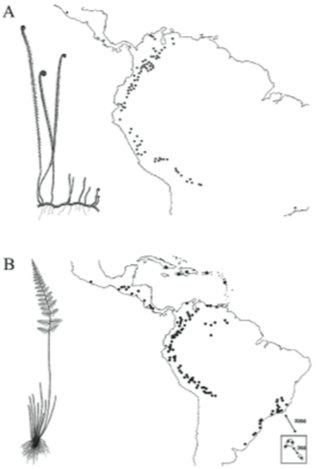
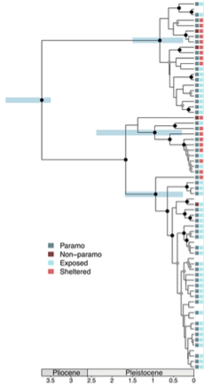
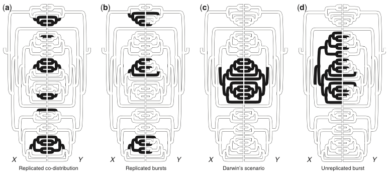
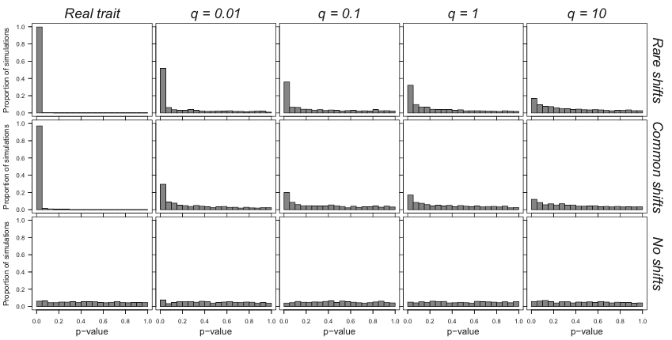

## Tree of life imbalance

```{r out.width = "50%", echo=FALSE, message=FALSE, warning=FALSE}
require(knitr)
include_graphics("figures/jawed_vertebrate.png") 
```

<font size="2">Alfaro et al. (2009) PNAS</font>

## Diversification

Diversification consists in the net accumulation of species through time.

$Diversification=\lambda-\mu$

where $\lambda$ is the speciation rate and $\mu$ is the extinction rate.

If $\lambda > \mu$, the diversification rate is positive and the number of species in a group will increase. In contrast, if $\lambda < \mu$, the diversification rate is negative and species number are diminishing through time.


## What do the rate means ?

The **speciation rate** is estimated for a species or lineage. It is the expected number of speciation event for a certain period of time. For instance, a lineage could have 2 speciation events per million of year on average.

Because it is an attribute of a lineage, this means that a given group could have much more frequent speciation events. For instance, a group of 10 species that have 10 * 2 = 20 speciation event per million year on average.


## The birth-death model

The birth death model is a continuous-time Markov process that describes how species fluctuate through time. It is a common model for phylogenetic trees and provide a way to simulate them.

The number of events within a given period of time follows a Poisson distribution.

```{r out.width = "45%", echo=FALSE, message=FALSE, warning=FALSE}
require(knitr)
include_graphics("figures/poisson.png") 
```


## Waiting time

Because of this Poisson distribution, the waiting time to the next speciation event follows an exponential distribution with parameter $\lambda$.

```{r out.width = "30%", echo=FALSE, message=FALSE, warning=FALSE}
require(knitr)
include_graphics("figures/Exponential_probability_density.png") 
```

The time to the next extinction event is exponential with parameter $\mu$ and the time to a speciation or an extinction event is exponential with parameter $\lambda + \mu$.

With this info, we could simulate trees!


## Tree simulation

Here is an example of how to simulate a tree in R.

```{r "birth_death_tree_sim", echo=TRUE, message=FALSE, warning=FALSE}
require(geiger)
atree <- sim.bdtree(b=0.2,d=0.05,stop="taxa",n=40,seed=46)
plot(atree,show.tip.label = F)
```


## Yule model

It is also called a "pure birth" model. It is simply a birth-death model with the extinction rate fixed to 0.

```{r "yule_tree_sim", echo=TRUE, message=FALSE, warning=FALSE}
atree <- sim.bdtree(b=0.2, d=0, stop="taxa", n=40, seed=46)
plot(atree, show.tip.label = F)
```


## Effect on tree shape

Not supringly, the speciation and extinction rates have strong impacts on the shape of the tree.

```{r "effect_parameters", echo=FALSE, message=FALSE, warning=FALSE}
atree1 <- sim.bdtree(b=0.2, d=0.1, stop="taxa", n=40, seed=46)
atree2 <- sim.bdtree(b=0.6, d=0.05, stop="taxa", n=40, seed=46)
op <- par(mfrow=c(1,2))
plot(atree1, show.tip.label = F)
title("lambda=0.2, delta=0.05")
plot(atree2, show.tip.label = F)
title("lambda=0.6, delta=0.05")
par(op)
```


## Estimating divesification rates

One obvious use of these models is to estimate diversification rates. But this is a difficult task.

Part of the difficulty is that we do not have information of extinct species !

```{r "drop_tips", echo=FALSE, message=FALSE, warning=FALSE}
op <- par(mfrow=c(1,2))
plot(atree1, show.tip.label = F)
title("Real tree")
plot(drop.extinct(atree1), show.tip.label = F)
title("Observed data")
par(op)
```

And this still assumes that we have sampled all current species! 


## An example

```{r "sim_tree", message=FALSE, eval=T}
# Simulate a tree with birth-death process
tree1 <- sim.bdtree(b=0.2,d=0.05,stop="taxa",n=400,seed=46)
# Remove extinct species
tree1 <- drop.extinct(tree1)
plot(tree1, show.tip.label=FALSE)
```


## Fit models {.smaller}

```{r "fit_divers_rate", message=FALSE, eval=T, warning=F}
require(diversitree)

## Fit a Yule model
# Make model
pbModel <- make.yule(tree1)
# Fit the model
pbMLFit <- find.mle(pbModel, 0.1)

# Fit a Birth-death model
# Make model
bdModel <- make.bd(tree1)
# Fit the model
bdMLFit <- find.mle(bdModel, c(0.1, 0.05), method = "optim", lower = 0)

# compare models
anova(bdMLFit, pure.birth = pbMLFit)
```


## Jamesonia-Eriosorus Complex

```{r "paramo data", message=FALSE, echo=FALSE, warning=F}
# Load packages
require(ape)
require(geiger)
require(phytools)
require(diversitree)
paramotree <- read.nexus("./data/JamesoniaPartFind_MCC.tre")
paramodata <- read.csv("./data/JamesoniaTraits2014Analysis.csv")
# Remove species for which we don't have complete data
paramodata <- paramodata[!is.na(paramodata$Name_in_tree),]
# Remove species in the tree that are not in the data matrix
species.to.exclude <- paramotree$tip.label[!(paramotree$tip.label %in% 
                                                   paramodata$Name_in_tree)]
paramotree <- drop.tip(paramotree,species.to.exclude)
rm(species.to.exclude)
# Name the rows of the data.frame with the species codes used as tree labels
rownames(paramodata) <- paramodata$Name_in_tree
# Remove unecessary variables
paramodata <- paramodata[,-c(1:3,7:14)]
# Order the data in the same order as the tip.label of the tree. In the
# present example, this was already the case.
paramodata <- paramodata[paramotree$tip.label,]
```

```{r out.width = "40%", out.extra='style="float:right; padding:30px"', echo=FALSE, message=FALSE, warning=FALSE}
require(knitr)
 
```

For the present tutorial, we will use data from Sánchez-Baracaldo and Thomas (2014) that studied a group of monophyletic ferns from the Jamesonia-Eriosorus Complex from the Andes. They studied mostly the impact of the colonization of the Paramo habitat in diversification rates and on morphology.


## Jamesonia-Eriosorus Complex

```{r out.width = "30%", echo=FALSE, message=FALSE, warning=FALSE}
require(knitr)
 
```


## Estimate rates {.smaller}

```{r "compare_models_Paramo", eval=T, echo=T}
# Fit a Yule model
pbModel <- make.yule(paramotree)
pbMLFit <- find.mle(pbModel, 0.1)

# Fit a Birth-death model
bdModel <- make.bd(paramotree)
bdMLFit <- find.mle(bdModel, c(0.1, 0.05), method = "optim", lower = 0)

# Compare models
anova(bdMLFit, pure.birth = pbMLFit)
```


## Parameters of the model

```{r "rates_paramo"}
# Parameters of the birth-death model
coef(bdMLFit)

# Diversification rate
diver <- coef(bdMLFit)[1]-coef(bdMLFit)[2]
names(diver) <- "diversification"
diver
```


## Lineage through time (ltt) plots {.smaller}

Lineage-through-time plots are effective ways to visualize patterns of lineage diversification through time. Under a pure-birth model on a semi-log scale, LTT plots follow a straight line on average.

```{r "Yule_topology",echo=FALSE}
yuletree <- sim.bdtree(b=0.2,d=0,stop="taxa",n=200,seed=46)
op <- par(mfrow=c(2,1), mar=c(4,3,2,1), mgp=c(1.8,0.5,0))
plot(yuletree, show.tip.label=FALSE)
title("Yule phylogeny (no extinction)")
res<-ltt(yuletree)
title("Lineage though time (ltt) plot")
par(op)
```


## ltt plot, birth-death model {.smaller}

In contrast, with extinction, the expectations are different. Because recent lineages are less likely to go extinct than old ones, the plots aften show a "pull to the present", where the number of lineages raises more quickly near the present.

```{r "BD_topology",echo=FALSE}
bdtree <- sim.bdtree(b=0.4,d=0.2,stop="taxa",n=200,seed=46)
bdtree <- drop.extinct(bdtree)
op <- par(mfrow=c(2,1), mar=c(4,3,2,1), mgp=c(1.8,0.5,0))
plot(bdtree, show.tip.label=FALSE)
title("Birth-death phylogeny")
res<-ltt(bdtree)
title("Lineage though time (ltt) plot")
par(op)
```


## Testing model using ltt plots {.smaller}

This provides another way to test if a tree fits a give model, for instance a yule model. We could plot the ltt of the tree alonside of the yule expectation for a tree of the same size.

```{r "ltt_null"}
bdtree <- sim.bdtree(b=0.4,d=0.2,stop="taxa",n=200,seed=46)
bdtree <- drop.extinct(bdtree)
# Pure-birth prediction:
h<-max(nodeHeights(bdtree))
b<-(log(Ntip(bdtree))-log(2))/h
# Pure birth simulations
trees<-pbtree(b=b,n=Ntip(bdtree),t=h,nsim=100,method="direct",quiet=TRUE)
# Plot ltt confidence intervals
ltt95(trees,gamma=FALSE,log=TRUE)
# ltt
ltt(bdtree, add=TRUE, log.lineages=FALSE, col="blue", lwd=2)
```


## Test with the example data


## Test with the example data

```{r "ltt"}
res<-ltt(paramotree, plot=FALSE)
plot(res,type="l",show.tree=TRUE,log.lineages=TRUE,main="LTT plot")
```


## Compared to Yule expectations {.smaller}

```{r "ltt_null_paramo", warning=FALSE, message=FALSE}
# Pure-birth prediction:
h<-max(nodeHeights(paramotree))
b<-(log(Ntip(paramotree))-log(2))/h
# Pure birth simulations
trees<-pbtree(b=b,n=Ntip(paramotree),t=h,nsim=100,method="direct",quiet=TRUE)
# Get ltt confidence intervals
object <- ltt95(trees,gamma=FALSE,log=TRUE,plot=FALSE)
```


## Compared to Yule expectations (2) {.smaller}

```{r "ltt_null_paramo_plot", warning=FALSE, message=FALSE}
par(bty="l", mar=c(4,3,2,1), mgp=c(1.8,0.5,0))
# Plot confidence intervals with median
plot(object,shaded=TRUE)
# Plot ltt of obsderved data
ltt(paramotree, add=TRUE, xaxis="flipped", log.lineages=FALSE, col="blue", lwd=2)
# Add legend
legend(x="topleft",c("Observed number of lineages","Median number of lineages", "95% confidence interval"),
    lty=c(1,1,0),lwd=c(2,2,0),pch=c(NA,NA,22),pt.cex=2.5,
    pt.bg=c("black","black",rgb(0,0,1,0.25)),col=c("blue","black","transparent"),bty="n")
```


## Trait dependent diversification rates

In the previous section, we saw how to estimate diversification rates for a whole tree. However, it is often of interest to estimate the diversification rate associated with a specific trait. For instance, we could test if reef fishes have greater diversification rates than pelagic fishes. 

Methods that can do this are called "State-dependent speciation and extinction (SSE) method. They come in different flavour wether they are applied on binary traits (BiSSE), multistate traits (MuSSE), quantitative traits (QuaSSE) or geographic locations (GeoSSE). We will look at the BISSE method here.


## BiSSE

In the BiSSE model, two processes are modeled. First the evolution of the character of interest. Second, the speciation and extinction rates for each state of the character. The idea is that according to the trait a species has, it will have distinct speciation or extinction rates. 

So in total, the BISSE approach can have a up to 6 characters:

* $\lambda_1$, $\lambda_2$, the speciation rates parameters for states 1 and 2
* $\mu_1$, $\mu_2$, the extinction rates parameters for states 1 and 2
* $q_{1\rightarrow 2}$, $q_{2\rightarrow 1}$, the transition rates from state 1 to 2 and from state 2 to 1, respectively


## Jamesonia-Eriosorus example

```{r out.width = "30%", out.extra='style="float:right; padding:30px"', echo=FALSE, message=FALSE, warning=FALSE}
require(knitr)
 
```

We will look again at the data from Sánchez-Baracaldo and Thomas (2014). In this dataset, species of Jamesonia-Eriosorus can be exposed or sheltered. We will test whether those habitats affect the diversification rates of the species.


## Exposed or sheltered habitats

Two models will be specifically compared:

1. An unconstrained model that will evaluate the speciation and extinction rates for species that are either exposed or sheltered.
1. A constrained modelwhich the speciation rates and the extinction rates will be equal for the two states ($\lambda_1 = \lambda_2$, $\mu_1 = \mu_2$).


## Unconstrained analysis

```{r "BISSE", message=FALSE,eval=TRUE}
require(diversitree)
# Convert the character into a numeric binary vector
char1 <- as.numeric(paramodata$ObservedMicrohabitat)
names(char1) <- row.names(paramodata)
# Create a BISSE likekihood model
lik <- make.bisse(paramotree, char1)
# Create starting points for the search
p <- starting.point.bisse(paramotree)
# Perform a ML search
fit <- find.mle(lik, p, method="subplex")
# The fitted parameters
round(coef(fit), 2)
```


## Constrained analysis

```{r "BISSE_ML_contrained",eval=TRUE}
lik.l <- constrain(lik, lambda1 ~ lambda0, mu1 ~ mu0)
fit.l <- find.mle(lik.l, p[-c(1,3)], method="subplex")
# Fitted parameters
round(coef(fit.l), 2)
```

## Model comparison

Let's compare the two models. `diversitree` uses a likelihood ratio test, even if the command used is called `anova`.

```{r "model_comp"}
# Test for statistical difference between the two models
anova(fit, equal.lambda=fit.l)
```

## Bayesian BISSE analysis

The BISSE model is also implemented in a Bayesian framework.

```{r "Bisse_MCMC",eval=FALSE}
# Generate priors. 
prior <- make.prior.exponential(0.1)
# Perform a first rapid search (with tunning set arbitrarily to 10) 
# that will be used to estimate the tuning parameters.
tmp <- mcmc(lik, p, nsteps=100, prior=prior, w=10, print.every=10)
# Then estimate the tunning parameters for the real analysis.
w <- diff(sapply(tmp[-(1:10),2:7], range))
# Run the true analysis.
samples <- mcmc(lik, fit$par, nsteps=1000, prior=prior, w=w,
                print.every=50)
```

## MCMC convergence checking

Now that we have the MCMC results, we will inspect the convergence of the MCMC chain using the `coda` package and we will plot the results.

```{r "load_samples",echo=FALSE,warning=FALSE,message=FALSE}
require(lattice)
require(coda)
load(file="samples.R")
```

```{r "MCMC_results", message=FALSE, fig.heigth=2,fig.width=6}
# Read the BayesTrait results in coda format
chain1 <- mcmc(samples,start=min(samples$i),end=max(samples$i),thin=1)
# Effective sample sizes
effectiveSize(chain1[,c(2:7)])
```

## MCMC results

```{r "profile_plots", fig.height=4}
col <- c("blue", "red")
profiles.plot(samples[-(1:100),c("lambda0", "lambda1")],col.line=col,
  las=1,xlab="Speciation rate", legend="topright",
  main="Speciation rates")
```

## Extinction

```{r "BISSE_extinction", fig.height=4}
profiles.plot(samples[-(1:100),c("mu0", "mu1")], col.line=col, las=1,
  xlab="Extinction rate", legend="topright",
  main="Extinction rates")
```

## Diversification

```{r "diversification_rates", fig.height=4}
diver<-data.frame(div0=samples$lambda0-samples$mu0,
                  div1=samples$lambda1-samples$mu1)
profiles.plot(diver[-(1:100),c("div0","div1")], col.line=col, las=1,
  xlab="Diversification rate", legend="topright",
  main="Diversification rates")
```


## Derivatives of the BISSE model

MUSSE - for multiple states characters

QUASSE - For continuous characters

GEOSSE - For biogeography

## The problem of pseudoreplication



Maddison and Fitzjohn (2015)

## Type I error issues



Rabosky and Goldberg (2015)

